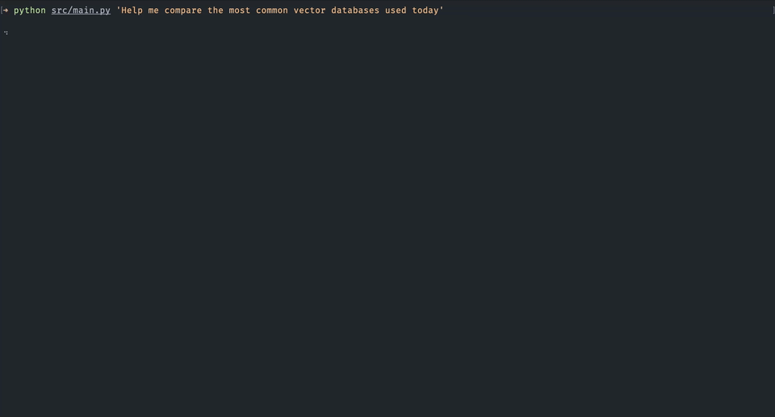
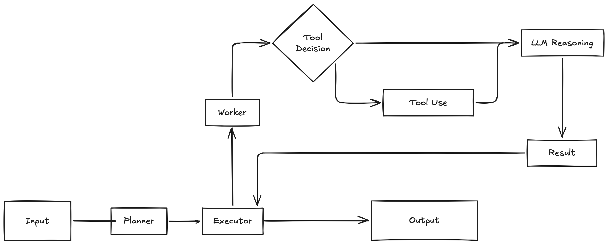

# GOA - Goal Oriented Assistant

GOA is the result of a small coding challenge.



## The Challenge

**Build a small AI agent that helps users tackle complex goals by breaking them into actionable steps and executing them.**

Examples (not mandatory): research assistant, document helper, project planner, learning path generator, ops helper, etc.

**You decide:**

- What type of goals or domain to focus on
- How the AI interaction works (chat, CLI, minimal UI, etc.)
- How tasks are shown and updated
- What level of automation vs. user confirmation you provide

**Core concept:**

User describes a high‑level goal → AI structures it into a TODO plan → Agent executes tasks using tools → User receives results.

## The Solution

Creating a simple CLI based research agent that decomposes a user goal into tasks, executes them using tools such as web search and returns a structured explanation of the findings in Markdown. The implementation concentrates on the following key pillars:

- Agentic Pattern
- Context management
- Observability
- Architecture

### Design Decisions

When I think about implementing an agent, I first think about what the agent should do, what the responsibilities are and whether there is already an agentic pattern that fits the problem. In this coding challenge I found the `Planner -> Executor -> Worker` pattern would be a good fit.

The `planner` breaks the user goal down into tasks. Those tasks are then handed over to the `executor` that orchestrates `workers` which can use tools to solve a task. The result of a worker is handed back to the executor, which collects all outputs dispatches the final result.



This separation keeps reasoning, orchestration and tool usage independent and allows future extensions such as parallel execution or additional tools.

Other decisions:

- Tool selection inside the worker
- Working memory with summarization for compact history
- Structured outputs for all LLM generations
- Human readable state persistence
- Event driven observability

### Context Strategy

Prompts are structured explicitly. System and user prompts are separated and all model outputs use JSON schemas to ensure predictable responses and consistent output formats.

The agent also maintains a compact working memory that stores summaries of completed steps. Each result is summarized and appended to the memory so that future steps have access to the most relevant information.

To avoid prompt growth, the memory is trimmed using a byte budget. When the size limit is exceeded, the oldest entries are removed while keeping the most recent task summaries. This keeps prompts small while still preserving the most relevant reasoning context for the current execution.

### Tradeoffs

In the interest of time the following tradeoffs have been made:

- Single turn CLI interaction
- Simple rolling buffer working memory
- Minimal error handling and validation
- No parallel execution of the workers
- Tool set intentionally kept small (web search only)
- Tests omitted due to time constraints

### How to run

Python 3.10+

1. Create a virtual environment
   `python -m venv .venv`

2. Activate the environment
   `source .venv/bin/activate`

3. Install dependencies
   `pip install -r requirements.txt`

4. Set your OpenAI API key
   `export OPENAI_API_KEY=your_api_key_here`

5. Run the agent
   `python src/main.py "Help me compare the most common vector databases used today" --verbose`

### Evaluation Scenarios

Example goals used to evaluate the system:

1. Compare the common vector databases used today<br>
   **Success**: the agent generates a structured comparison plan and summarizes differences.<br><br>
2. Explain how Kubernetes works and how to deploy a simple service<br>
   **Success**: the agent generates a logical learning sequence and coherent explanations.<br><br>
3. Research monitoring tools for Python applications<br>
   **Success**: the agent uses the web search tool when external information is required.<br><br>
4. Create a learning path for becoming an AI engineer<br>
   **Success**: the agent generates a step-by-step learning roadmap.

### Example

```
Goal: Help me compare the most common vector databases used today

Plan:
✔ 1. Identify the most common vector databases used today
➜ 2. Collect key features and specifications of each vector database
  3. Compare performance metrics and use cases of the vector databases
  4. Summarize the advantages and disadvantages of each vector database

⠏ Researching task

[15:50:46] [PLANNER] Planning Started
[15:50:48] [PLANNER] Planning Completed
[15:50:48] [TOKENS] in=161 out=60 total=221
[15:50:48] [EXECUTOR] Starting execution of task 1
[15:50:48] [WORKER] Tool routing started
[15:50:49] [WORKER] Tool decision: web_search (reason: needs_current_information)
[15:50:49] [TOKENS] in=258 out=22 total=280
[15:50:50] [TOOL] web_search ok
[15:50:50] [WORKER] Solver started
[15:50:55] [WORKER] Solver completed
[15:50:55] [TOKENS] in=508 out=244 total=752
[15:50:55] [EXECUTOR] Starting execution of task 2
...
```
